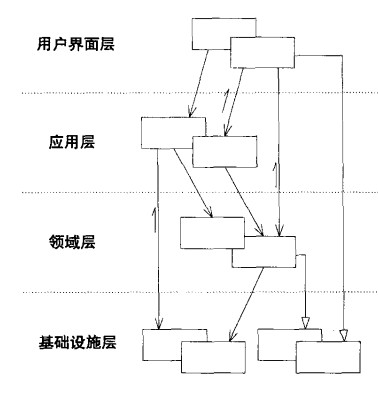
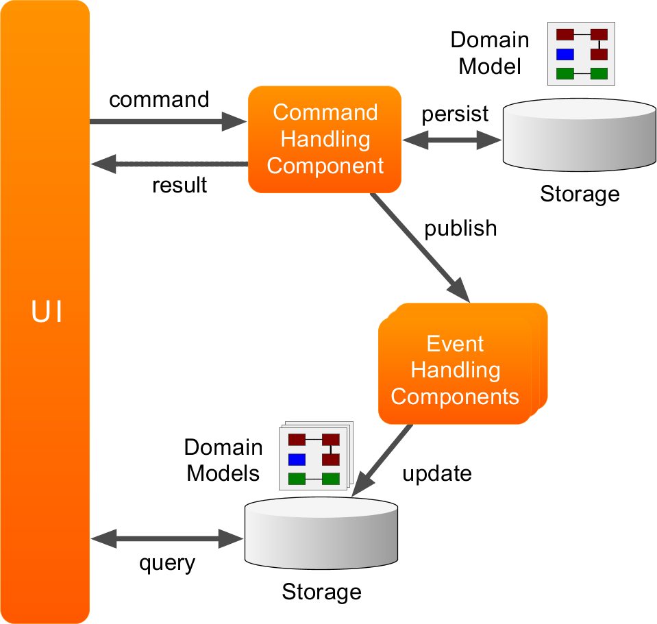
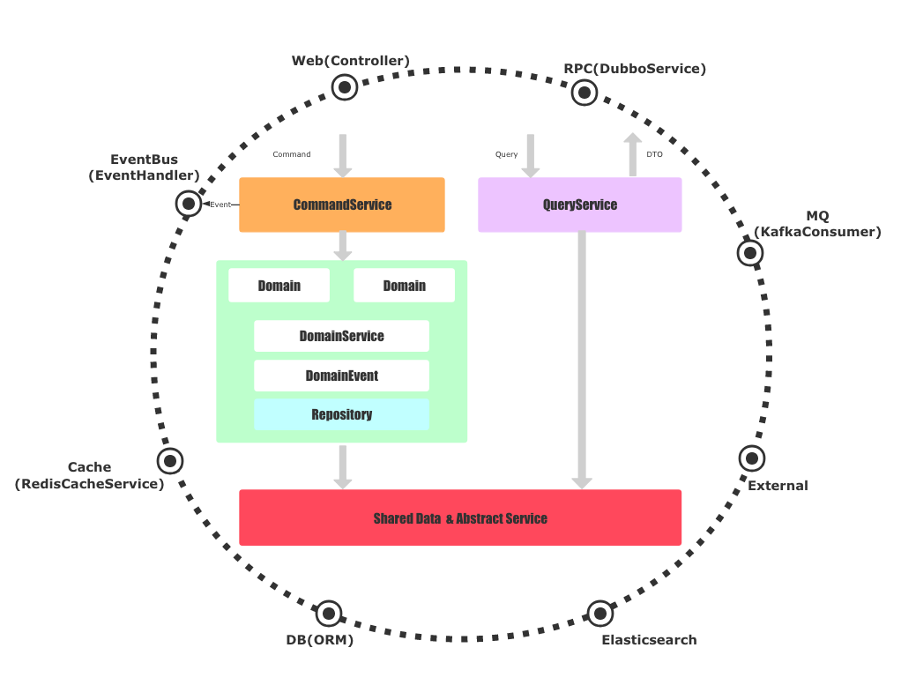

# poto-framework

- process-oriented to object 面向过程到面向对象编程，缩写poto

### 现状
- 目前微服务很火，而且现在说架构都是基于业务的宏观设计，而恰恰忽略了代码层面的架构，所有现在大部分的项目是微服务划分的很好，
在打开实际的各个微服务的代码，有的可以说几乎不可维护的状态，代码都是基于Restful mvc的代码结构层次，甚至划分module都是mvc（简单的项目还是可以用的），一旦项目复杂,日积月累的业务代码的堆积，
各种层次技术人员的随意编写代码，代码惨不忍睹，相信大家最头疼的就是看别人的代码。
- 拿着面向对象的语言写着面向过程的代码。

### DDD领域驱动
- DDD不是一套架构，而是一种架构思想，poto-framework只是框架的约束，降低DDD的实践门槛。业务层领域的划分才是重点。

### DDD四层架构
- Evans在它的《领域驱动设计：软件核心复杂性应对之道》书中推荐采用分层架构去实现领域驱动设计：

 
  
  其实这种分层架构我们早已驾轻就熟，MVC模式就是我们所熟知的一种分层架构，我们尽可能去设计每一层，使其保持高度内聚性，让它们只对下层进行依赖，体现了高内聚低耦合的思想。
分层架构的落地就简单明了了，用户界面层我们可以理解成web层的Controller，应用层和业务无关，它负责协调领域层进行工作，领域层是领域驱动设计的业务核心，包含领域模型和领域服务，领域层的重点放 在如何表达领域模型上，无需考虑显示和存储问题，基础实施层是最底层，提供基础的接口和实现，领域层和应用服务层通过基础实施层提供的接口实现类如持久化、发送消息等功能。

- 改进DDD分层架构和DIP依赖倒置原则

    

  DDD分层架构是一种可落地的架构，但是我们依然可以进行改进，Vernon在它的《实现领域驱动设计》一书中提到了采用依赖倒置原则改进的方案。
所谓的依赖倒置原则指的是：高层模块不应该依赖于低层模块，两者都应该依赖于抽象，抽象不应该依赖于细节，细节应该依赖于抽象。

  从图中可以看到，基础实施层位于其他所有层的上方，接口定义在其它层，基础实施实现这些接口。依赖原则的定义在DDD设计中可以改述为：领域层等其他层不应该依赖于基础实施层，两者都应该依赖于抽象，具体落地的时候，这些抽象的接口定义放在了领域层等下方层中。这也就是意味着一个重要的落地指导原则： 所有依赖基础实施实现的抽象接口，都应该定义在领域层或应用层中。

  采用依赖倒置原则改进DDD分层架构除了上面说的DIP的好处外，还有什么好处吗？其实这种分层结构更加地高内聚低耦合。每一层只依赖于抽象，因为具体的实现在基础实施层，无需关心。只要抽象不变，就无需改动那一层，实现如果需要改变，只需要修改基础实施层就可以了。

### java的设计原则
- 单一职责原则
- 依赖倒置原则
- 开闭原则

### 什么是CQRS?
CQRS 架构全称是Command Query Responsibility Segregation，即命令查询职责分离，事件驱动。名词本身最早应该是Greg Young提出来的，但是概念却很早就有了。
本质上，CQRS也是一种读写分离的机制，是一种思想很简单清晰的设计模式，架构图如下：

### CQRS把整个系统划分成两块：

- Command Side 写的一边
接收外部所有的Insert、Update、Delete命令，转化为Command，每一个Command修改一个Aggregate的状态。Command Side的命令通常不需要返回数据。注意：这种“写”操作过程中，可能会涉及“读”，因为要做校验，这时可直接在这一边进行读操作，而不需要再到Query Side去。
- Query Side 读的一边
接受所有查询请求，直接返回数据。

### 为什么使用CQRS
- [领域] 在 DDD 中占据了核心的地位，DDD 通过领域对象之间的交互实现业务逻辑与流程，并通过分层的方式将业务逻辑剥离出来，单独进行维护，从而控制业务本身的复杂度。但是作为一个业务系统，[查询]的相关功能也是不可或缺的。在实现各式各样的查询功能时，往往会发现很难用领域模型来实现，查询更多的是直接查data object(DO)就可以完成，用领域对象反而增加了复杂度.

### DDD、CQRS架构落地

- 架构中，我们平等的看待Web、RPC、DB、MQ等外部服务，基础实施依赖圆圈内部的抽象
- 当一个命令Command请求过来时，会通过应用层的CommandService去协调领域层工作，而一个查询Query请求过来时，则直接通过基础实施的实现与数据库或者外部服务交互。我们所有的抽象都定义在圆圈内部，实现都在基础设施。

### 如何使用
- https://github.com/bfxyzshb/sample-poto

### 文档
- https://github.com/bfxyzshb/poto-framework/wiki

